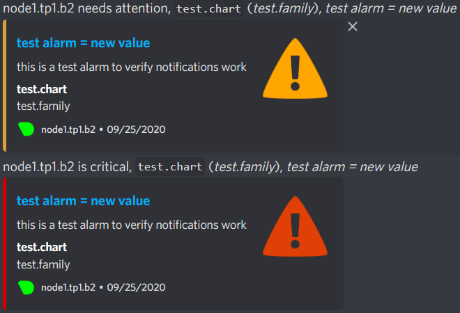

# TP1 : Déploiement classique

# 0. Prérequis

## Partitionnement


1. Création des VG

```bash
[root@node1 ~]$ sudo vgcreate data /dev/sdb
  Physical volume "/dev/sdb" successfully created.
  Volume group "data" successfully created
[root@node1 ~]$ sudo vgs
  VG     #PV #LV #SN Attr   VSize  VFree 
  centos   1   2   0 wz--n- <7,00g     0 
  data     1   0   0 wz--n- <5,00g <5,00g
```

2. On crée les LV


```bash
[root@node1 ~]$ sudo lvcreate -L 2G data -n site1
Logical volume "site1" created.
```

```bash
[root@node1 ~]$ sudo lvcreate -l 100%FREE data -n site2
Logical volume "site2" created.
```


```bash
[root@node1 ~]$ sudo lvs
  LV    VG     Attr       LSize   Pool Origin Data%  Meta%  Move Log Cpy%Sync Convert
  root  centos -wi-ao----  <6,20g                                                    
  swap  centos -wi-ao---- 820,00m                                                    
  site1 data   -wi-a-----   2,00g                                                    
  site2 data   -wi-a-----  <3,00g                                                    
```

1. Formatage

```bash
[root@node1 ~]$ sudo mkfs -t ext4 /dev/data/site1
```


4. Définition du montage automatique au boot

Modification de  `/etc/fstab` :

```bash
/dev/data/site1 /srv/site1 ext4 defaults 0 0
/dev/data/site2 /srv/site2 ext4 defaults 0 0
```


```bash
[root@node1 ~]$ lsblk
NAME            MAJ:MIN RM  SIZE RO TYPE MOUNTPOINT
sda               8:0    0    8G  0 disk 
├─sda1            8:1    0    1G  0 part /boot
└─sda2            8:2    0    7G  0 part 
  ├─centos-root 253:0    0  6,2G  0 lvm  /
  └─centos-swap 253:1    0  820M  0 lvm  [SWAP]
sdb               8:16   0    5G  0 disk 
├─data-site1    253:2    0    2G  0 lvm  /srv/site1
└─data-site2    253:3    0    3G  0 lvm  /srv/site2
sr0              11:0    1 1024M  0 rom  
sr1              11:1    1 1024M  0 rom  
```


## Accès internet


```bash
[root@node1 ~]$ cat /etc/sysconfig/network-scripts/ifcfg-enp0s3
TYPE=Ethernet
PROXY_METHOD=none
BROWSER_ONLY=no
BOOTPROTO=dhcp
DEFROUTE=yes
IPV4_FAILURE_FATAL=no
IPV6INIT=yes
IPV6_AUTOCONF=yes
IPV6_DEFROUTE=yes
IPV6_FAILURE_FATAL=no
IPV6_ADDR_GEN_MODE=stable-privacy
NAME=enp0s3
UUID=8f2e8629-b36e-4ad8-89af-d2fe9cc81a8a
DEVICE=enp0s3
ONBOOT=yes
```
* Test de la connexion avec un curl

```bash
[root@node1 ~]$ curl google.com
<HTML><HEAD><meta http-equiv="content-type" content="text/html;charset=utf-8">
<TITLE>301 Moved</TITLE></HEAD><BODY>
<H1>301 Moved</H1>
The document has moved
<A HREF="http://www.google.com/">here</A>.
```
### Accès local

VM 1  -> VM 2 :

```bash
[root@node1 ~]$ ping 192.168.1.12 -c 2
PING 192.168.1.12 (192.168.1.12) 56(84) bytes of data.
64 bytes from 192.168.1.12: icmp_seq=1 ttl=64 time=0.618 ms
64 bytes from 192.168.1.12: icmp_seq=2 ttl=64 time=0.259 ms
```

VM 2 -> VM 1 :

```bash
[root@node2 ~]$ ping 192.168.1.11 -c 2
PING 192.168.1.11 (192.168.1.11) 56(84) bytes of data.
64 bytes from 192.168.1.11: icmp_seq=1 ttl=64 time=0.458 ms
64 bytes from 192.168.1.11: icmp_seq=2 ttl=64 time=0.635 ms
```

### Hostnames

```bash
[root@node1 ~]$ hostname
node1
```

* les machines doivent pouvoir se joindre par leurs noms respectifs 
  
Pour cela on modifie /etc/hosts:

```bash
192.168.1.11 node1
192.168.1.12 node2
```

Vérification :

```bash
[root@node1 ~]$ ping node2 -c 2
PING node2 (192.168.1.12) 56(84) bytes of data.
64 bytes from node2 (192.168.1.12): icmp_seq=1 ttl=64 time=0.356 ms
64 bytes from node2 (192.168.1.12): icmp_seq=2 ttl=64 time=0.645 ms
```


### User Admin

Pour cela on fait:

```bash
[root@node1 ~]$ sudo useradd -d /home/admin admin
```

On vérifie:

```bash
[root@node1 ~]$ cat /etc/passwd | grep admin
admin:x:1001:1001::/home/admin:/bin/bash
```


On modifie sudoers:

```bash
admin ALL=(ALL) ALL
```

```bash
[admin@node1 ~]$ sudo ls /
bin  boot  dev	etc  home  lib	lib64  media  mnt  opt	proc  root  run  sbin  srv  sys  tmp  usr  var
```

on est ok


### SSH

On dépose la clé dans le fichier authorized-keys puis:

```bash
PS C:\Users\akram> ssh admin@192.168.1.11
Last login: Thu Sep 24 10:10:30 2020 from 192.168.1.1
[admin@node1 ~]$ 
```
on est encore ok

* Configuration du pare-feu

```bash
admin@node1 ~]$ sudo firewall-cmd --list-all
customzone (active)
  target: DROP
  icmp-block-inversion: no
  interfaces: enp0s3 enp0s8
  sources: 
  services: ssh
  ports: 
  protocols: 
  masquerade: no
  forward-ports: 
  source-ports: 
  icmp-blocks: 
  rich rules: 
```

## 1.Setup serveur Web

### Installation nginx
```
[admin@node1 ~]$ sudo yum install -y epel-release
[...]
Complete!
[admin@node1 ~]$ sudo yum install nginx
[...]
Complete!
```

```bash
[admin@node1 ~]$ whereis nginx
nginx: /usr/sbin/nginx /usr/lib64/nginx /etc/nginx /usr/share/nginx /usr/share/man/man3/nginx.3pm.gz /usr/share/man/man8/nginx.8.gz
```

### Création et configuration des fichiers

```
dr-x------.  3 nginx_user nginx_group 4096 Sep 24 10:12 site1
dr-x------.  3 nginx_user nginx_group 4096 Sep 24 10:12 site2

-r--------. 1 nginx_user nginx_group    13 Sep 24 10:12 index.html
```
Ajout d'un utilisateur nginx_user ayant pour mot de passe nginx_user
```
[root@node1 ~]# adduser nginx_user
[root@node1 ~]# passwd nginx_user

[root@node1 ~]# groupadd nginx_group

[root@node1 ~]# gpasswd -a nginx_user nginx_group

[root@node1 ~]# chown nginx_user:nginx_group /srv/site1
[root@node1 ~]# chown nginx_user:nginx_group /srv/site2
[root@node1 ~]# chown nginx_user:nginx_group /srv/site1/index.html
[root@node1 ~]# chown nginx_user:nginx_group /srv/site2/index.html
```
### Ouverture des ports


```bash
[admin@node1 ~]$ sudo firewall-cmd --permanant --add-port="80/tcp"
sucess
[admin@node1 ~]$ sudo firewall-cmd --permanant --add-port="443/tcp"
sucess
```
Génération d'une clé et d'un certificat

```
[admin@node1 ~]# openssl req -new -newkey rsa:2048 -days 365 -nodes -x509 -keyout server.key -out server.crt
blablabla
Common Name (eg, your name or your server's hostname) []:node1.tp1.b2
Email Address []:

[admin@node1 ~]# mv server.crt /etc/pki/tls/certs/node1.tp1.b2.crt
[admin@node1 ~]# mv server.key /etc/pki/tls/private/node1.tp1.b2.key
[admin@node1 ~]# chmod 400 /etc/pki/tls/private/node1.tp1.b2.key
[admin@node1 ~]# chmod 400 /etc/pki/tls/certs/node1.tp1.b2.crt
```

### Configuration de nginx

* Fichier de conf:

```bash
[admin@node1 ~]$ sudo cat /etc/nginx/nginx.conf
worker_processes 1;
error_log nginx_error.log;
pid /run/nginx.pid;
user web;
events {
	worker_connections 1024;
}

http {
	server {
		listen 80;
		server_name node1.tp1.b2;

		location / {
			return 301 /site1;
		}
		location /site1 {
			alias /srv/site1;
		}
		location /site2 {
			alias /srv/site2;
		}
	}
	server {
		listen 443 ssl;

		server_name node1.tp1.b2;
		ssl_certificate /home/admin/node1.tp1.b2.crt;
		ssl_certificate_key /home/admin/node1.tp1.b2.key;

                location / {
                        return 301 /site1;
                }
                location /site1 {
                        alias /srv/site1;
                }
                location /site2 {
                        alias /srv/site2;
                }
	
	}
}
```

### Vérification

```bash
[admin@node2 ~]$ curl -L node1
<h1> Bonjour du site 1 </h1>
[admin@node2 ~]$ curl -kL https://node1
<h1> Bonjour du site 1 </h1>
```


## II. Script de sauvegarde

### Préparation

#### Création du user et des fichiers nécessaires:

```
[admin@node1 ~]# adduser backup
[admin@node1 ~]# passwd backup
[admin@node1 ~]# gpasswd -a backup nginx_group
[admin@node1 ~]# mkdir /srv/backup
[admin@node1 ~]# chown backup:backup /srv/backup
[admin@node1 ~]# chmod 700 /srv/backup
[admin@node1 ~]# touch /var/log/backup.logs
[admin@node1 ~]# chown backup:backup /var/log/backup.logs
[admin@node1 ~]# chmod 700 /var/log/backup.logs
```

* on modifie la crontab avec la ligne suivante:

```bash 
0 0-23 * * * backup sh /home/backup/tp1.backup.sh /srv/site1
0 0-23 * * * backup sh /home/backup/tp1.backup.sh /srv/site2
```


- utilisation de systemd pour lancer le script
```
[root@node1 ~]# vim /etc/systemd/system/backup.service
[Unit]
Description=Start backup every hours

[Service]
User=backup
Restart=always
RestartSec=3600s
ExecStart=/bin/bash /srv/tp1_backup.sh all

[root@node1 ~]# systemctl start backup
[root@node1 ~]# systemctl status backup
? backup.service - Start backup every hours
Loaded: loaded (/etc/systemd/system/backup.service; static; vendor preset: disabled)
Active: activating (auto-restart) since Sun 2020-09-27 00:22:47 CEST; 9s ago
Main PID: 6136 (code=exited, status=0/SUCCESS)
```
### Script de backup
```
#!/bin/sh

if [ ! -z $1 ]
then

	path_file_file=$1

	file=$(echo $1 | rev | cut -d '/' -f 1 | rev)

	date=$(date +"%Y-%m-%d")
	time=$(date +"%H:%M:%S")	

	tarname='/srv/backup/'$file'_'$date'_'$time'.tar.gz'

	tar -Pzcf $tarname $path_file_file

	echo $path_file_file' sauvegarder en tant que '$tarname

	backups=$(ls -l /srv/backup | grep $file | wc -l)

	if test $backups -ge 8
	then
		to_delete=$(ls /srv/backup | grep $file | sort | head -n 1)
		rm -rf '/srv/backup/'$to_delete	
	
	fi

	exit 0

else

	echo 'Fichier manquant'
	exit 22

fi
```

### Restauration

On fait la commande suivante:

```bash
tar -xf /srv/backup/site1
```


## III. Monitoring, alerting


* On installe netdata:
```bash
bash <(curl -Ss https://my-netdata.io/kickstart.sh)
```

* puis on configure netdata, pour cela on ajoute les lignes suivantes:

```bash
SEND_DISCORD="YES"

DISCORD_WEBHOOK_URL="https://discordapp.com/api/webhooks/760222423109992518/zUDwEnM2VvxURm0n4_z361Hkh5JkGahDws_v1NwSdPcLAE87wXKframK6QyRxk1ZZbHz"

DEFAULT_RECIPIENT_DISCORD="netdata"
```

* Test:

