# TP 1

## I. Exploration locale en solo

### 1. Affichage d'informations sur la pile TCP/IP locale

**🌞 Affichez les infos des cartes réseau de votre PC**

 

***Carte réseau sans fil Wi-Fi :***

   Suffixe DNS propre à la connexion. . . : auvence.co
   Description. . . . . . . . . . . . . . : Intel(R) Dual Band Wireless-AC 3165
   Adresse physique . . . . . . . . . . . : ***AC-ED-5C-5E-E0-89 <-- Adresse MAC***
   DHCP activé. . . . . . . . . . . . . . : Oui
   Configuration automatique activée. . . : Oui
   Adresse IPv6 de liaison locale. . . . .: fe80::cc20:f13c:213f:e73d%16(préféré)
   Adresse IPv4. . . . . . . . . . . . . .: ***10.33.3.201 <-- IP*** (préféré)
   Masque de sous-réseau. . . . . . . . . : 255.255.252.0
   Bail obtenu. . . . . . . . . . . . . . : jeudi 16 janvier 2020 13:34:30
   Bail expirant. . . . . . . . . . . . . : jeudi 16 janvier 2020 15:34:28
   Passerelle par défaut. . . . . . . . . : 10.33.3.253
   Serveur DHCP . . . . . . . . . . . . . : 10.33.3.254
   IAID DHCPv6 . . . . . . . . . . . : 111996252
   DUID de client DHCPv6. . . . . . . . : 00-01-00-01-24-63-2B-7A-54-E1-AD-4B-6C-01
   Serveurs DNS. . .  . . . . . . . . . . : 10.33.10.20
                                       10.33.10.2
                                       8.8.8.8
                                       8.8.4.4
   NetBIOS sur Tcpip. . . . . . . . . . . : Activé
   

***Carte Ethernet Ethernet :***

   Statut du média. . . . . . . . . . . . : Média déconnecté
   Suffixe DNS propre à la connexion. . . : home
   Description. . . . . . . . . . . . . . : Realtek PCIe GBE Family Controller
   Adresse physique . . . . . . . . . . . : ***54-E1-AD-4B-6C-01 <-- Adresse MAC***
   DHCP activé. . . . . . . . . . . . . . : Oui
   Configuration automatique activée. . . : Oui
   
   
**🌞 Affichez votre gateway**

PS C:\Users\akram> netstat -nr

Liste d'Interfaces
  3...54 e1 ad 4b 6c 01 ......Realtek PCIe GBE Family Controller
 11...0a 00 27 00 00 0b ......VirtualBox Host-Only Ethernet Adapter
 64...02 00 4c 4f 4f 50 ......Npcap Loopback Adapter
 18...ae ed 5c 5e e0 89 ......Microsoft Wi-Fi Direct Virtual Adapter #2
 15...00 50 56 c0 00 01 ......VMware Virtual Ethernet Adapter for VMnet1
 23...00 50 56 c0 00 08 ......VMware Virtual Ethernet Adapter for VMnet8
 16...ac ed 5c 5e e0 89 ......Intel(R) Dual Band Wireless-AC 3165
 12...ac ed 5c 5e e0 8d ......Bluetooth Device (Personal Area Network)
  1...........................Software Loopback Interface 1

IPv4 Table de routage

Itinéraires actifs :
Destination réseau    Masque réseau  Adr. passerelle   Adr. interface Métrique
          0.0.0.0          0.0.0.0      ***10.33.3.253 <- gateway Ynov***  10.33.3.201     55
        10.33.0.0    255.255.252.0         On-link       10.33.3.201    311
[...]

### En graphique (GUI : Graphical User Interface)

En utilisant l'interface graphique de votre OS :  

**🌞 Trouvez comment afficher les informations sur une carte IP (change selon l'OS)**
  * trouvez l'IP, la MAC et la [gateway](../../cours/lexique.md#passerelle-ou-gateway) pour l'interface WiFi de votre PC
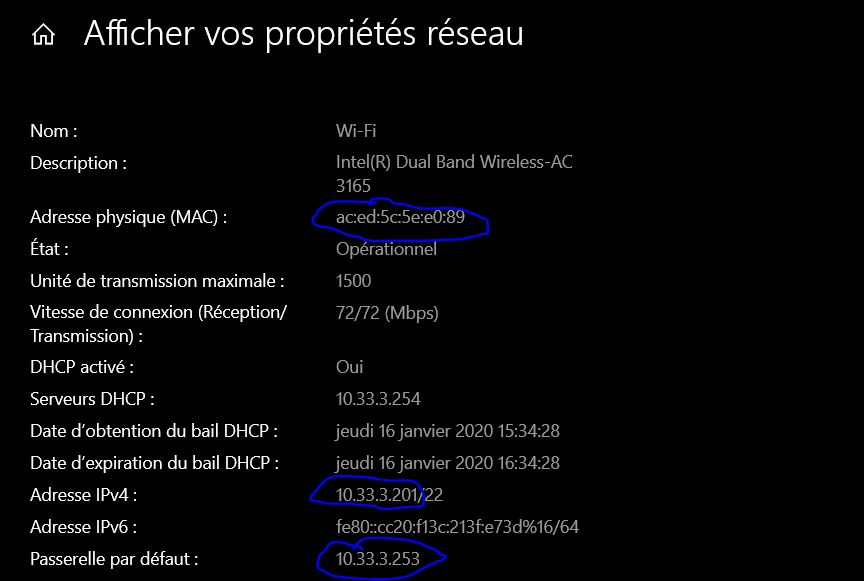

### Questions

* 🌞 à quoi sert la [gateway](../../cours/lexique.md#passerelle-ou-gateway) dans le réseau d'YNOV ?

### Réponse:

La gateway d'Ynov permet de permettre l'accés des étudiants vers Internet.

## 2. Modifications des informations

### A. Modification d'adresse IP (part 1)  

🌞 Utilisez l'interface graphique de votre OS pour **changer d'adresse IP** :

* changez l'adresse IP de votre carte WiFi pour une autre
* ne changez que le dernier octet

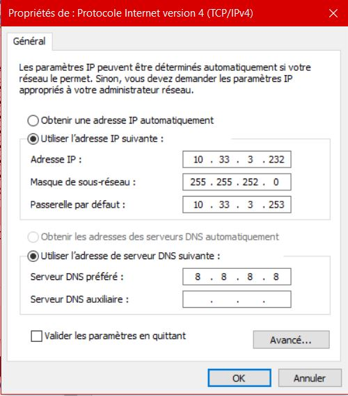
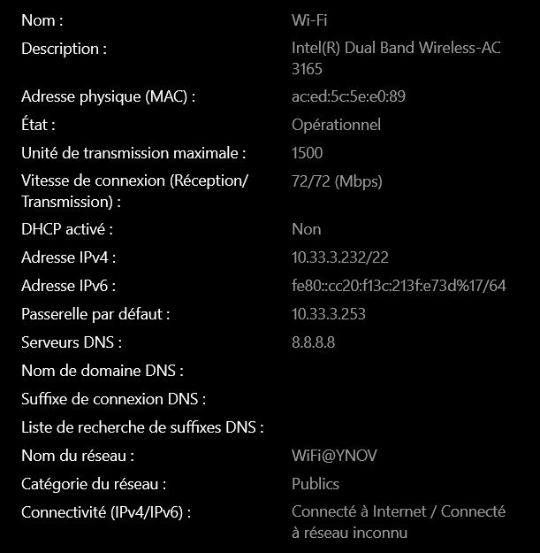

### B. `nmap`
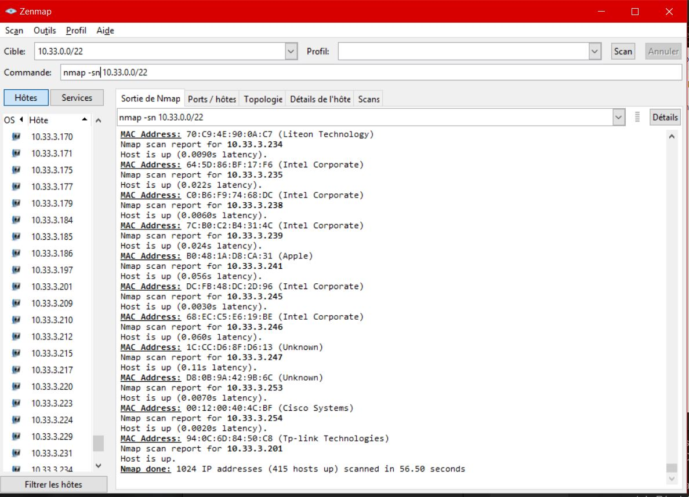

### C. Modification d'adresse IP (part 2)
* 🌞 Modifiez de nouveau votre adresse IP vers une adresse IP que vous savez libre grâce à `nmap`

# II. Exploration locale en duo

## 3. Modification d'adresse IP

## 4. Utilisation d'un des deux comme gateway 
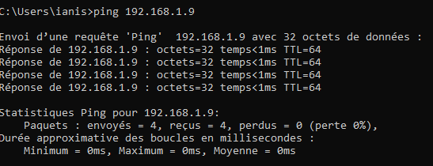
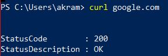

## 5. Petit chat privé
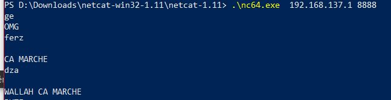

## 6. Wireshark

* téléchargez l'outil [Wireshark](https://www.wireshark.org/)
* 🌞 utilisez le pour observer les trames qui circulent entre vos deux carte Ethernet. Mettez en évidence :
  * un `ping`
  * un `netcat`
  * un échange pendant que le PC1 sert du PC2 comme gateway
  * prenez moi des screens des trames en question,
  * on décortiquera tout ça au prochain cours ensemble
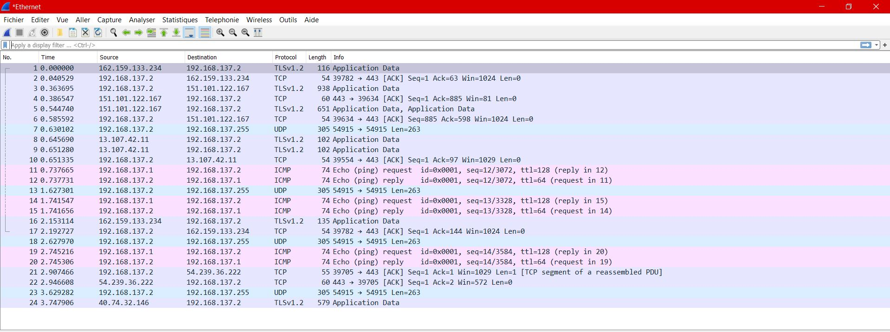

## 7. Firewall
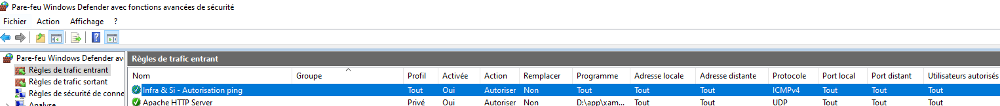

# III. Manipulations d'autres outils/protocoles côté client

## 1. DHCP
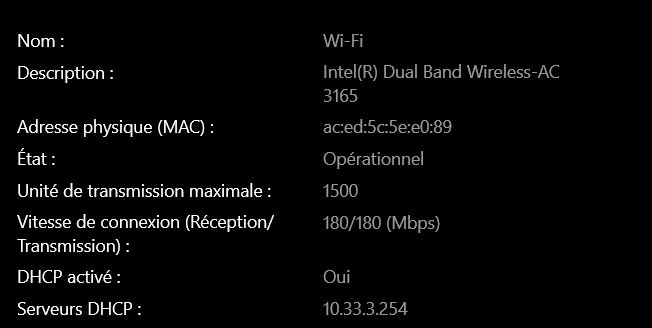
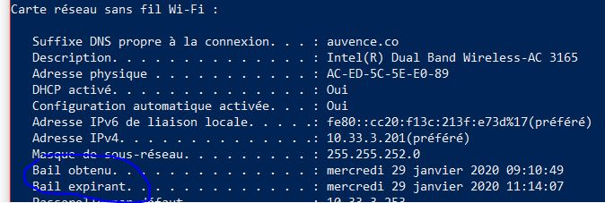
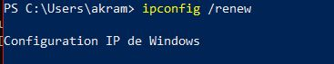
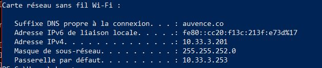

## 2. DNS

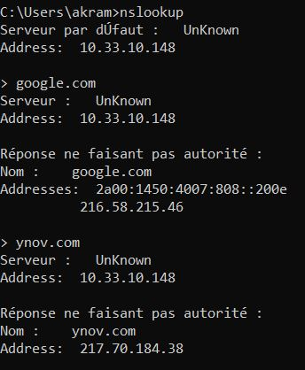
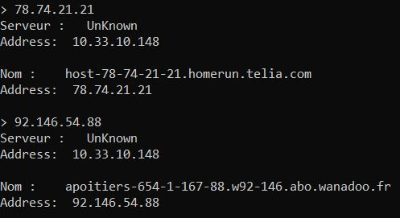